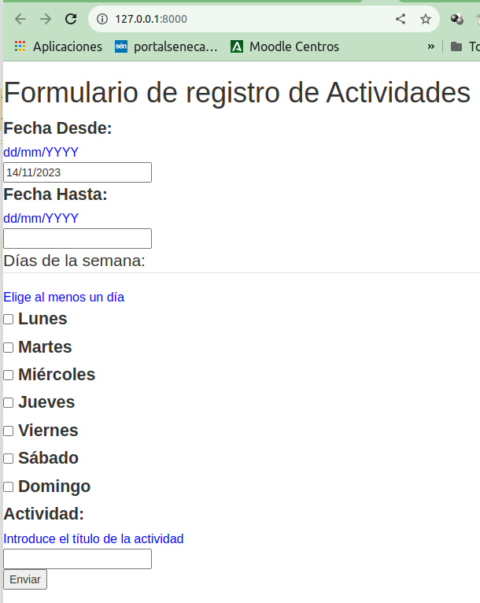
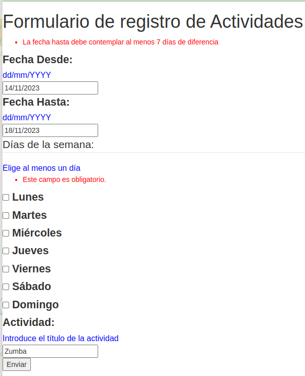
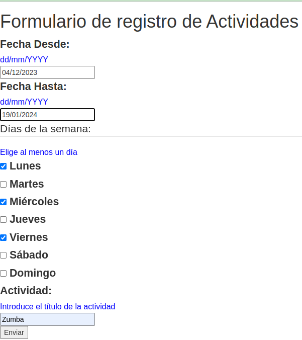
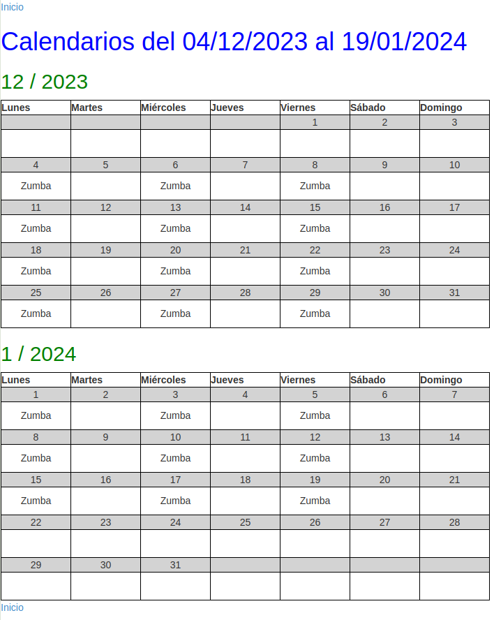

# PTP - UD3 Formularios y templates

Usa el código proporcionado como plantilla de este proyecto para completar
las siguientes funcionalidades.

<!-- TOC -->
* [PTP - UD3 Formularios y templates](#ptp---ud3-formularios-y-templates)
  * [Formulario de Actividades (CalendarForm)](#formulario-de-actividades-calendarform)
  * [View y Template Calendar](#view-y-template-calendar)
  * [Puntuaciones](#puntuaciones)
<!-- TOC -->

## Formulario de Actividades (CalendarForm)

El siguiente formulario permite enviar por **GET** a la
url /calendar/ los datos mostrados en la
captura.

Requisitos para el Formulario:
- Campos
  - **Fecha desde (atributo: date_from)**
    - Obligatorio, formato de entrada 
    (dd/mm/YYYY,"%d/%m/%Y"), valor
    por defecto día actual.
  - **Fecha hasta (atributo: date_to)**
    - Opcional, mismo formato de entrada anterior, valor por defecto vacío
  - **Días de la semana (atributo: weekdays)**
    - Obligatorio, de tipo checkbox (Multiple Choice Field), valor por defecto vacío
  - **Actividad (atributo: activity)**
    - Oligatorio, valor por defecto vacío, longitud máxima 20 caracteres
- Mostrar ayudas (Exactamente como en la imagen):
  - label = "Fecha Desde"
  - label sufix = ":"
  - help text = "dd/mm/YYYY"
- Validaciones globales
  - Se debe validar que la fecha hasta es al menos 7 días mayor que la fecha hasta 
    y elevar un ValidationError cuando la validación falle. El mensaje de error 
    ha de coincidir literalmente con "La fecha hasta debe contemplar al menos 7 días de diferencia"
- Renderización en el template
  - Se debe renderizar el formulario en el template index.html
  - El nombre del formulario en el context debe ser 'form'
  - Se debe utilizar el renderizado automático del formulario
    en el template mediante elementos div
  - El parámetro action del form debe usar el template tag url
    para generar la url de la vista calendar

**Ejemplo formulario actividades** 

**Ejemplo fallo Validación campos fecha hasta y Días de la semana**

## View y Template Calendar

Al envío correcto y validación del formulario anterior se debe mostrar
un calendario que refleje la actividad registrada desde la fecha de inicio
a la fecha de fin en el día apropiado de la semana.

- La url se debe registar con name='calendar' y el path debe coincidir con "/calendar/"
- Se debe mostrar una cabecera que indique la fecha de inicio hasta la fecha de fin seleccionada
- Si el usuario no introdujo nada en el campo fecha hasta, la fecha de fin
  será la inicial más 30 días.
- No se debe mostrar el número del día si este no pertenece al mes mostrado en calendario.
  Por ejemplo, no se debe mostrar el 31 de Enero ni el 1 de Marzo en el calendario de Febrero.
- Sólo se debe mostrar la actividad en caso de que el día de la semana esté entre
los seleccionados en el formulario y la fecha del día esté entre las fechas seleccionadas.

**Envío Formulario**

**Resultado de Formulario enviado correctamente**

## Puntuaciones

| Descripción                                                | Nombre                                 | Puntos | SUMA |
|------------------------------------------------------------|----------------------------------------|--------|------|
| Test atributo date_from en Formulario                      | test_form_date_from_field              | 0.5    | 0.5  |
| Test atributo date_to en Formulario                        | test_form_date_to_field                | 0.5    | 1    |
| Test atributo weekdays en Formulario                       | test_form_weekdays_field               | 1      | 2    |
| Test atributo activity en Formulario                       | test_form_activity_field               | 0.5    | 2.5  |
| Test validación general en Formulario                      | test_form_is_valid                     | 1      | 3.5  |
| Test creación de formulario en index                       | test_view_index_form                   | 1      | 4.5  |
| Test registro de url para /calendar/                       | test_url_calendar                      | 0.5    | 5    |
| Test envío formulario a View calendar, Templates correctos | test_view_calendar                     | 1      | 6    |
| Test template calendar.html cabecera H1                    | test_template_calendar_h1              | 1      | 7    |
| Test template calendar.html cabeceras H2                   | test_template_calendar_month_tittles   | 1.5    | 8.5  |
| Test calendar.html tablas mensuales                        | test_template_calendar_monthly_tables  | 1.5    | 10   |
